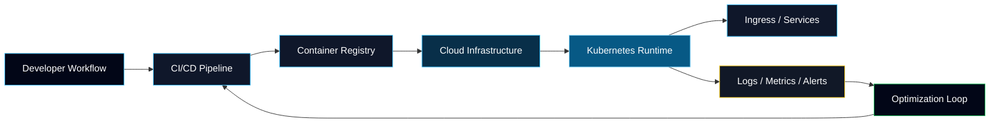
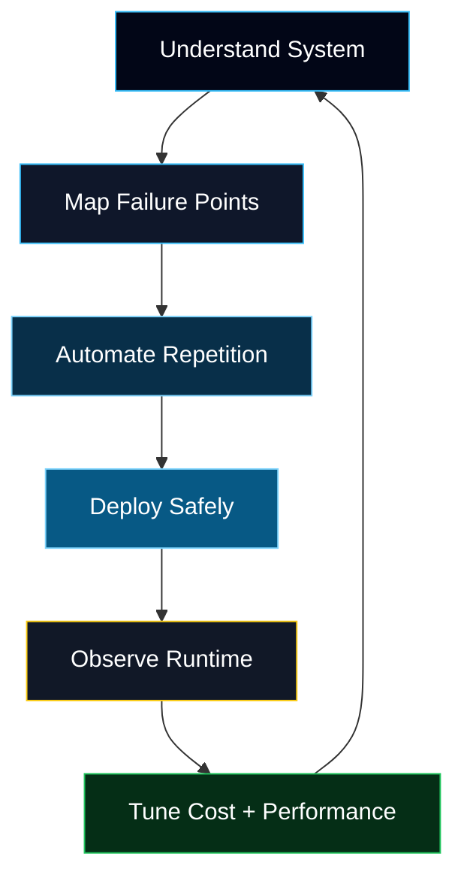

<!--
  Talha Imtiaz — GitHub Profile README
  Direction: Platform Engineering / Cloud-Native / Control Plane Aesthetic
-->

<p align="center">
  
</p>

<h1 align="center">
  ⚡ System.init("Talha Imtiaz")
</h1>

<p align="center">
  <strong>DevOps Engineer · Cloud-Native Systems · Platform Engineering</strong>
</p>

<p align="center">
  <a href="mailto:talha.imtiaz.dev@gmail.com">
    
  </a>
  <a href="https://linkedin.com/in/talha-imtiaz342">
    
  </a>
  <a href="https://talhaimtiaz.me">
    
  </a>
</p>

---

<table>
<tr>
<td width="58%" valign="top">

## `system.identity`

```yaml
name: Talha Imtiaz
role: DevOps Engineer
base: Lahore, Pakistan

specialization:
  - Cloud-native infrastructure
  - Kubernetes operations
  - CI/CD automation
  - Production deployment workflows
  - Platform engineering foundations

primary_cloud: Google Cloud Platform
expanding_into: AWS
target_path: Platform Engineer
````

</td>
<td width="42%" valign="top">

## `status.board`

```txt
MODE        platform-engineering
FOCUS       reliability + automation
RUNTIME     kubernetes
CLOUD       gcp → aws
PIPELINES   github-actions + gitlab-ci
IaC         terraform + pulumi
```

</td>
</tr>
</table>

---

## `mission.control`

I work on the infrastructure layer that helps software move from local development to reliable production.

My focus is not only writing code, but making systems deployable, observable, repeatable, and easier to operate. I care about clean deployment flows, strong automation, reliable infrastructure, and platforms that reduce operational friction for engineering teams.

```bash
$ talha --focus

> containerize applications
> build ci/cd pipelines
> provision cloud infrastructure
> deploy workloads on kubernetes
> improve logs, metrics, and operational visibility
> automate repetitive engineering workflows
```

---

## `control.plane`



---

## `stack.surface`

<p align="center">
  
</p>

<table>
<tr>
<td width="25%" valign="top">

### Cloud

```txt
GCP
AWS
IAM
Networking
Compute
Storage
```

</td>
<td width="25%" valign="top">

### Runtime

```txt
Kubernetes
Docker
Ingress
Services
Autoscaling
Workloads
```

</td>
<td width="25%" valign="top">

### Automation

```txt
Terraform
Pulumi
GitHub Actions
GitLab CI
Bash
Pipelines
```

</td>
<td width="25%" valign="top">

### Application

```txt
Python
Node.js
FastAPI
Next.js
PostgreSQL
Redis
```

</td>
</tr>
</table>

---

## `impact.telemetry`

<table>
<tr>
<td width="50%" valign="top">

### Infrastructure Scaling

```txt
Designed and maintained GKE infrastructure
supporting growth from 70 to 400+ users.
```

</td>
<td width="50%" valign="top">

### Traffic Reliability

```txt
Helped production workloads sustain
5x traffic spikes through cloud-native scaling.
```

</td>
</tr>

<tr>
<td width="50%" valign="top">

### CI/CD Optimization

```txt
Reduced Next.js build time from ~6 minutes
to ~2 minutes through pipeline improvements.
```

</td>
<td width="50%" valign="top">

### AI Operations

```txt
Built Robin Relay, an AI SRE assistant for
alert summarization and incident intelligence.
```

</td>
</tr>

<tr>
<td width="50%" valign="top">

### Real-Time Systems

```txt
Worked on low-latency video and microscope
streaming workflows for AI-assisted analysis.
```

</td>
<td width="50%" valign="top">

### Platform Direction

```txt
Focused on building internal platforms,
automation layers, and reliable delivery systems.
```

</td>
</tr>
</table>

---

## `featured.systems`

<table>
<tr>
<td width="50%" valign="top">

### Robin Relay

**AI SRE Automation Platform**

An incident intelligence system that uses RAG workflows and automation to summarize alerts, reduce noise, and improve operational visibility.

```txt
FastAPI · RAG · Azure OpenAI · n8n · Alert Intelligence
```

<a href="https://talhaimtiaz.me">
  
</a>

</td>
<td width="50%" valign="top">

### CareAi Therapy Platform

**Real-Time Healthcare Web Platform**

A privacy-aware therapy platform with real-time sessions, transcription workflows, and interactive EMDR tooling.

```txt
Realtime Web · WebSockets · Transcription · Session Workflows
```

<a href="https://talhaimtiaz.me">
  
</a>

</td>
</tr>

<tr>
<td width="50%" valign="top">

### HypeRadar

**AI Marketing Automation Suite**

Award-winning FYP platform for AI-assisted campaign generation, template-based content creation, and campaign scheduling.

```txt
OpenAI · Automation · Scheduling · Full-Stack Platform
```

<a href="https://talhaimtiaz.me">
  
</a>

</td>
<td width="50%" valign="top">

### Microscope AI Video Pipeline

**Live Video + AI Processing System**

Low-latency microscope video pipeline for AI-assisted analysis, processing, and real-time visualization.

```txt
Video Processing · Streaming · AI Pipeline · Low Latency
```

<a href="https://talhaimtiaz.me">
  
</a>

</td>
</tr>
</table>

---

## `operating.model`



---

## `github.signal`

<p align="center">
  
  
</p>

<p align="center">
  
</p>

---

## `learning.pipeline`

```txt
Current direction:

01. Deepen AWS architecture fundamentals
02. Strengthen Terraform-based infrastructure design
03. Build more Kubernetes-heavy platform projects
04. Improve production observability patterns
05. Move toward remote platform engineering roles
```

---

## `background`

<table>
<tr>
<td width="33%" valign="top">

### Education

```txt
B.S. Computer Science
Ghulam Ishaq Khan Institute
```

</td>
<td width="33%" valign="top">

### Recognition

```txt
Dean's Honor List
3rd Place — FYP Expo 2025
```

</td>
<td width="33%" valign="top">

### Publication

```txt
Genetic Algorithm-Based
Timetable Generator
IEEE 2024
```

</td>
</tr>
</table>

---

## `connect.route`

<p align="center">
  <a href="mailto:talha.imtiaz.dev@gmail.com">
    
  </a>
  <a href="https://linkedin.com/in/talha-imtiaz342">
    
  </a>
  <a href="https://talhaimtiaz.me">
    
  </a>
  <a href="https://github.com/talhaimtiaz09">
    
  </a>
</p>

---

