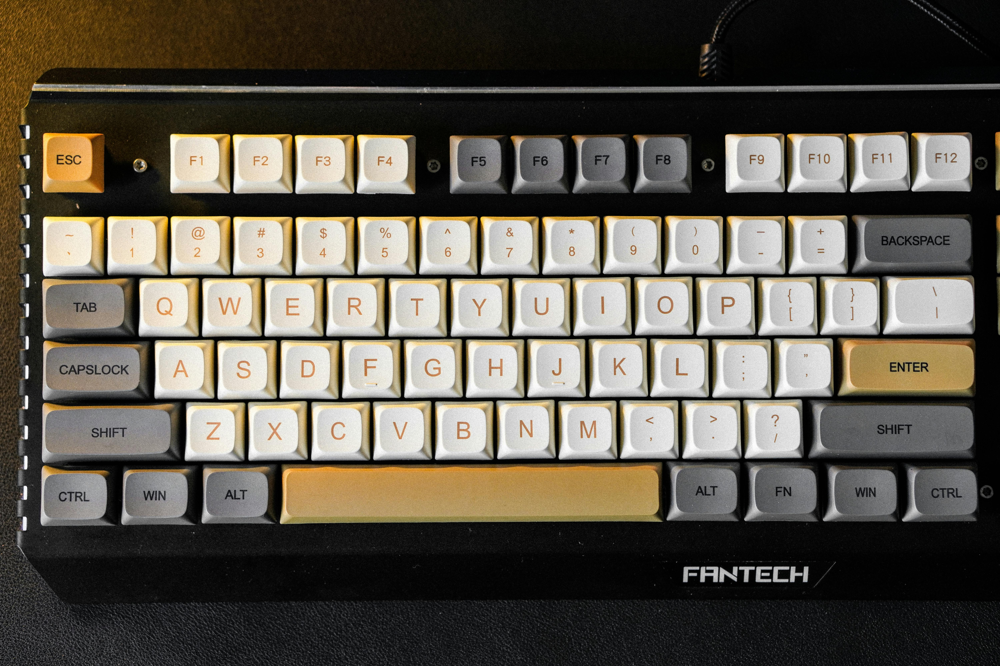

# ⚡ System.init("Talha Imtiaz")

  

  

### 🛰️ Mission Brief
I am a **Software Engineer** focused on building and maintaining **cloud-native, AI-powered systems**. I take full ownership from architecture to deployment, specializing in **Kubernetes infrastructure, real-time platforms, and CI/CD automation**.

---

## 🛠️ Technical Arsenal

| ☁️ Infrastructure & Cloud | 🤖 AI & Backend | 💻 Frontend & Tools |
| :--- | :--- | :--- |
|  | | |
|  |  |  |
|  |  |  |
|  |  |  |

---

## 📈 Impact Metrics

* 🚀 **Scaling Excellence:** Architected GKE infrastructure at **CarbonTeq**, scaling from **70 to 400+ users** while sustaining **5x traffic spikes**.
* ⚡ **Build Optimization:** Reduced Next.js build times by **66%** (6m → 2m) through engineered CI/CD pipelines.
* 🤖 **AI Efficiency:** Developed **Robin Relay**, an AI SRE assistant that reduced alert noise by **75%** using RAG and Azure OpenAI.
* ⏱️ **Real-Time Performance:** Achieved **~5ms latency** for live microscope streaming and optimized video pipelines by **64%**.

---

## 🧪 Featured Labs

#### 🧠 **[Robin Relay](https://talhaimtiaz.me)**
> **Agentic SRE Automation** | Built with FastAPI and n8n, this system uses RAG to summarize incidents and visualize alert heatmaps with 30% better retrieval efficiency.

#### 🏥 **[CareAi Therapy Platform](https://talhaimtiaz.me)**
> **GDPR-Compliant Real-time Web** | Supporting 100+ concurrent sessions with sub-200ms latency for live transcription and EMDR tools.

#### 📡 **[HypeRadar](https://talhaimtiaz.me)**
> **AI Marketing Suite** | FYP Award-winning platform leveraging OpenAI and 1000+ templates for automated multi-platform campaign scheduling.

---

## 📊 Performance Stats

---

## 🎓 Background
* **B.S. Computer Science** | Ghulam Ishaq Khan Institute (GIKI)
* **Awards:** Dean’s Honor List | 3rd Place FYP EXPO 2025
* **Publication:** Genetic Algorithm-Based Timetable Generator (IEEE 2024)

---

## 📫 Establish Connection

